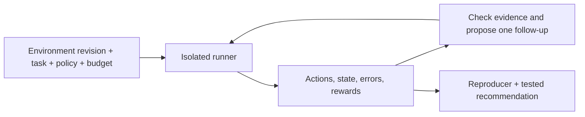

# EnvScout: research, executed probes, and a bounded first release

Date: October 6, 2026 (America/Toronto). This is a research proposal and local
feasibility study, not a completed autonomous product or a Qwen improvement result.
The user's current request is to investigate external agent environments. Existing
research-agent, training, and reward code has not been replaced.

## The user job

An engineer connects a checkpoint to a public environment and needs to know whether
its results are trustworthy and what to change next. A useful report distinguishes
model failures, execution/setup failures, grading concerns, and budget-sensitive
outcomes. Difficulty is conditional on the model, harness, task, and budget.

The concrete output is an experiment another developer can rerun: pinned source,
task inputs, actions, actual observations, expected behavior, and a tested change
where possible. A company's name does not validate a finding. Reproducible evidence
and a reviewed environment contract do.

## What already exists

- [OpenEnv validation](https://github.com/huggingface/OpenEnv/issues/1177) already
  has a runtime validation implementation and active follow-up work. The live API
  review on this date identified episode isolation as remaining work, while seed,
  replay, discovery, and other checks already have implementations in pending PRs.
  This is a potential focused contribution, not an unclaimed broad project.
- [Terminal-Bench review automation](https://github.com/harbor-framework/terminal-bench/blob/main/docs/TASK_REVIEW_AUTOMATION.md)
  already includes known-solution/no-op controls, agent trials, and adversarial
  verifier hardening. Generic reward auditing is established work.
- [AgentLab](https://github.com/ServiceNow/AgentLab) runs web-agent experiments and
  offers AgentXray for inspecting traces. [Inspect Scout](https://meridianlabs-ai.github.io/inspect_scout/)
  analyzes failures and validates its scanners. A trace viewer or an LLM-written
  explanation alone is not the differentiation.
- [Verifiers #2682](https://github.com/PrimeIntellect-ai/verifiers/issues/2682)
  illustrates a crashed attempt being ranked as an implicit zero reward, but
  [PR #2691](https://github.com/PrimeIntellect-ai/verifiers/pull/2691) already proposes
  a fix. Reproduce or review it; do not duplicate the work or claim its discovery.

Detailed source/status review is saved under
`out/research/environment-scout-20261006/MAINTAINER_RESEARCH.md`. Issue and PR status
can change; check again before starting an upstream contribution.

## Experiment 1: can repeated trials interfere?

**Hypothesis:** the pinned MCPMark-lite example keys state by task ID. Two server
processes that share a storage directory can overwrite each other's same-task
state. Separate directories per rollout should prevent that interference.

**Expected signal:** a completed task in session A loses its output and verifier
score when session B initializes the same task under the shared root. With separate
roots, A retains its output and score. A different task ID is the control.

**Decision rule:** require all nine declared observations in each of three shared
and three isolated trials. Report an integration hazard, not an upstream bug, when
the behavior is consistent with documented task-scoped workspaces.

Used the actual unchanged MCP server and verifier from the
[Fireworks-compatible MCPMark-lite example](https://github.com/eval-protocol/mcpmark-lite-rft-example/tree/f493e95c9d6218dd718a0c17c140600097fd91e8),
commit `f493e95c9d6218dd718a0c17c140600097fd91e8`. Each trial had two live MCP client
sessions and two server processes. Calls were deliberately interleaved; this does
not require a probabilistic scheduler race. The solution was scripted from the
tool-returned input, not generated by a model.

| Configuration | A's score before B resets | A's score afterward | Repeats |
| --- | ---: | ---: | ---: |
| Same task ID, shared root | 1.0 | 0.0 | 3/3 |
| Same task ID, separate roots | 1.0 | 1.0 | 3/3 |

The different-task-ID marker survived in all six trials. There were 84 real MCP
tool calls and zero model calls. Source and probe hashes were checked against the
saved report. This is a tested runner-configuration recommendation: isolate each
concurrent repetition's workspace. It is not a newly discovered server defect,
nor a test of the full Eval Protocol runner's default isolation behavior.

Artifacts: [readout](../out/research/environment-scout-20261006/isolation-probe/README.md),
[probe](../out/research/environment-scout-20261006/isolation-probe/probe.py),
[raw report](../out/research/environment-scout-20261006/isolation-probe/report.json).

## Experiment 2: can a real grader distort the outcome?

**Hypothesis:** current pinned BrowserGym scoring still exhibits the previously
reported numeric-format and partial-credit conversion behaviors.

**Expected signal:** actual scoring functions reproduce the reported cases while
clean controls behave as expected. **Decision rule:** classify as a credited known
issue reproduction if present, or fixed if absent. Additional arithmetic examples
are exploratory candidates and require separate impact review.

Executed BrowserGym's AssistantBench scorer at commit
`e71419aef5759a11cb7896a26c36e5f7e92d82b2`:

| Prediction | Reference | Actual score | Interpretation |
| --- | --- | ---: | --- |
| `1000` | `1000` | 1.0 | Exact-number control |
| `14,2` | `14.2` | 1.0 | Decimal-comma control |
| `3,080,000` | `3080000` | 0.0 | Known formatting counterexample |
| `1,000` | `1` | 1.0 | Known counterexample under thousands interpretation |
| `2000` | `1000` | 0.30685 | Intentional distance-based partial credit |

These reproduce [BrowserGym #404](https://github.com/ServiceNow/BrowserGym/issues/404);
they are not our discovery. Commas are locale-dependent, so indiscriminately
stripping every comma would not be a justified general fix.

Also executed the actual MiniWoB wrapper validation method with a controlled page
stub and raw rewards. A raw reward of 0.1 became 1.0, reproducing the transformation
described in [#392](https://github.com/ServiceNow/BrowserGym/issues/392). The pinned
MiniWoB task source assigns 0.1 after a wrong-card submission. This is a component
reproduction, not a live browser episode. Both known issues already have open fix
PRs: [#405](https://github.com/ServiceNow/BrowserGym/pull/405) and
[#396](https://github.com/ServiceNow/BrowserGym/pull/396), respectively. Review their
current status before contributing.

Exploration additionally produced a score of 7.907755 for plain `-1` against
`-1000`, independently of comma parsing. This is an arithmetic counterexample;
impact on actual benchmark tasks is not established. No negative numeric reference
was found among the 33 public validation examples. Do not claim a new benchmark
failure or an effect on published model rankings from this alone.

Artifacts: [readout](../out/research/environment-scout-20261006/browsergym-audit/README.md),
[probe](../out/research/environment-scout-20261006/browsergym-audit/probe.py),
[observations](../out/research/environment-scout-20261006/browsergym-audit/report.json),
[manifest](../out/research/environment-scout-20261006/browsergym-audit/manifest.json).
Actual upstream scoring code executes; package initialization is bypassed and
MiniWoB browser state is stubbed. Versions and licenses are in the manifest.

## What these experiments establish

They demonstrate two useful report types: a verified configuration change and a
credited scoring counterexample. They do not demonstrate autonomous discovery,
Qwen competence, better training-task selection, or model improvement. All policy
actions in the local probes were scripted. No paid model API or GPU was used.

The remaining product hypothesis is that a bounded investigator can get an engineer
to a correct, reproducible next action with less manual effort than using existing
framework tools. That hypothesis is still untested.

## Recommended first release

Build a small CLI and reuse the existing transcript viewer. Begin with a local,
pinned environment plus one supported adapter. The report should answer:

1. What did the model or scripted control actually do?
2. Is the observation consistent with the declared environment contract?
3. What single change did we test, and did it alter the result?
4. What can we conclude, and what remains unresolved?

Keep the model under test separate from the investigator. Qwen base or the existing
trained checkpoint performs the task. An optional stronger model proposes a probe
from a small allowed menu. The runner executes it, and programmatic checks plus
reviewed task expectations decide what the evidence supports. The investigator
must be able to return `unresolved`; it does not certify an environment bug.

Start with three probe types: fresh-versus-reused episode, known-correct versus
known-incorrect output, and paired action-budget changes. Controlled runner checks
should execute before paid model trials. Reference answers and verifier internals
belong to the evaluator, never the target policy's context.

## Integration and reuse

- Reuse `Policy.act/reset`, endpoint handling, action parsing, manifests, and saved
  trace presentation from Envoy. The current paper prompts and citation reward
  are task-specific and should not be carried into unrelated filesystem tasks.
- [OpenEnv REPL](https://github.com/huggingface/OpenEnv/tree/main/envs/repl_env) is a
  promising next adapter because it accepts persistent Python actions. It is an
  executor and scoring facility, not an already validated benchmark. Define named
  tasks and their success criteria; disable recursive model calls for the first
  pilot. Run model-generated code in an isolated container.
- Keep Qwen's Python-action interface in the initial transfer pilot. Give base and
  trained Qwen identical wrappers, prompts, limits, and decoding settings. Results
  on new external tasks measure transfer; they cannot replace the original
  held-out research-agent improvement gate.
- Investigate OpenEnv's missing episode-isolation check as a possible upstream
  contribution after checking current PR work. The MCPMark-lite result above is
  not evidence that OpenEnv itself has an isolation defect.
- Keep the previous difficulty-model experiments as supporting research. Do not
  build a universal environment difficulty leaderboard or an RL curriculum claim.

## How to evaluate EnvScout itself

Use a small reviewed set containing known failures, healthy controls, and cases
where evidence is insufficient. Separate development examples from new test cases.
Compare a model-selected investigation with a simple fixed-order diagnostic policy
under the same call/time cap. Record correct diagnoses, false alarms, unresolved
cases, reproducible recommendations, model calls, and observed cost.

Known issue reproductions validate the mechanism, not autonomous discovery. Planted
faults validate checks, not upstream bug-finding. Stronger evidence would be a
previously unseen case correctly investigated and an independently reviewed useful
report or contribution. If a fixed diagnostic script does equally well, ship the
script and keep the AI optional.

First engineering gate: package one report like the isolation experiment into a
one-command reproducible workflow. Then add one bounded Qwen run and one follow-up.
Estimate the cost from a measured smoke run before expanding; reserve funds for a
rerun and stop the GPU immediately afterward. Do not start another training job.

Planning estimate: a few focused days for the first command/report and roughly
one to two weeks for a reviewed model-driven demo, depending on sandbox and model
access. This estimate does not include proving RL training gains.
