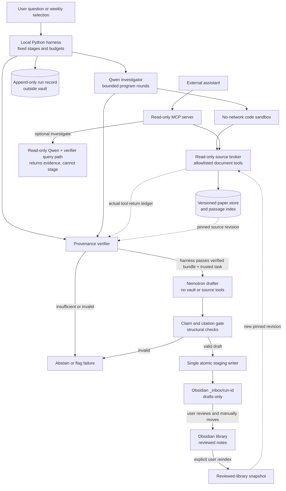

# Evidence-gated research harness: design

Status: proposed, 2026-09-29. This specifies the target system; it is not a claim that the full pipeline currently works. The supporting architecture research and current-code audit are in [the architecture decision](RESEARCH_LIBRARY_HARNESS_ARCHITECTURE_20260928.md).

Implementation update, 2026-09-29: `src/harness/` now contains the atomic inbox writer, a frozen-source evidence verifier, a structural question-note gate, an outside-vault run record, and a CPU-only fixture replay. The replay does not use live Qwen or Nemotron. It receives fixture-controlled returned document IDs because the current Docker sandbox still lacks a host tool-call ledger. Existing direct vault writers have not yet been migrated. See [the repository map](REPOSITORY_LAYOUT.md) for the current code boundaries.

## Purpose

The product produces a useful weekly AI-paper digest and answers later questions against accumulated evidence. The user receives drafts in an Obsidian `_inbox/` and alone decides what enters `library/`. Qwen is the inexpensive, multi-step investigator over version-pinned original papers. Nemotron turns a bounded evidence bundle into readable notes. The Python harness owns orchestration, source verification, draft validation, logging, and the only service-side vault writer.

There are two separate success gates. **Product usability:** a reviewed digest is worth reading and promoted evidence can be queried through MCP. **Model improvement:** under an identical held-out paper task and harness, trained Qwen gives more supported answers than base Qwen without unacceptable execution, latency, or cost regressions. A valid quote, a valid citation ID, or a working MCP connection is not either gate.

## Target architecture



The MCP server is an **external read-only facade** over the source service. Its optional investigation path reuses Qwen and verification in a query-only coordinator that cannot reach the staging writer. The Qwen sandbox uses a narrow local broker; it does not need a general MCP client, network access, credentials, or a vault mount. Today the MCP server instead has three high-level tools—`search_research_papers`, `get_research_source`, and optional `investigate_research_question`—and its lexical search is separate from Qwen's passage search. Sharing one versioned source service is a migration step, not an existing property. Preserve the current Qwen tool syntax for the first paired checkpoint comparison; any change to it gets a new protocol version and its own comparison.

The paper store and Obsidian `library/` are distinct sources. Original papers carry pinned publication and extraction revisions. Reviewed library notes may be added through a separately versioned snapshot. `_inbox/` never enters either index, including through the generic vault importer.

## One run, end to end

```mermaid
sequenceDiagram
    actor User
    participant H as Python harness
    participant Q as Qwen sandbox
    participant S as Source broker
    participant V as Verifier
    participant N as Nemotron
    participant I as Inbox writer
    participant L as Run ledger
    User->>H: Question or weekly paper selection
    H->>L: Record pinned inputs and limits
    H->>Q: Investigate(question, source revision, budget)
    loop At most N model rounds and T tool calls total
        Q->>S: Pinned allowlisted document-tool call
        S-->>Q: Pinned tool result and source IDs
        S->>L: Log tool arguments and returned IDs
    end
    Q-->>H: Candidate answer, spans, trajectory, outcome
    H->>V: Verify against pinned source and tool ledger
    V-->>H: Verified bundle or typed failure
    alt Evidence verified
        H->>N: Trusted task and template + verified bundle only
        N-->>H: Structured claims, citations, limitations
        H->>V: Check claim IDs, source versions, and note structure
        V-->>H: Structural pass or rejection; semantic support pending
        alt Structural pass
            H->>I: Stage immutable draft batch under _inbox/run-id
            I-->>H: Staged paths and content hashes
            H->>L: Record staged outcome, cost, and checks
            I-->>User: Draft to inspect
            User->>User: Check relevance and claim support
            User->>User: Manually move accepted notes into library
        else Draft rejected
            H->>L: Record validation failure
        end
    else Evidence insufficient or invalid
        H->>L: Record abstention or provenance failure
    end
```

No automatic transition from `staged_inbox` to `promoted` exists in the harness or MCP. The user may edit or reject a draft. The service can observe a later reviewed-library snapshot but cannot treat the mere presence of a draft or a self-declared JSON `human_reviewed` value as independent review.

## Boundaries and contracts

**Run identity and state.** A run has a unique `run_id`, task kind (`question` or `weekly_digest`), immutable corpus ID and hash, paper extraction/index versions, code revision, Qwen checkpoint, Nemotron model, prompt hashes, decoding settings, seed, hardware, and separate model-round and tool-call limits. Record transitions as append-only events outside the vault: `created → investigating → evidence_verified → drafted → citation_checked → staged_inbox`, with typed `no_evidence`, `incomplete`, `unavailable`, `invalid_provenance`, `invalid_draft`, and `failed` branches. `no_evidence` means only that this bounded run found no usable spans, not that the full literature lacks an answer. Version the event schema and store full model/tool transcripts as run artifacts rather than placing them in Obsidian.

**Source and tool contract.** The authoritative source service accepts bounded, read-only operations and returns canonical text and offsets to the host. For the first paired base/trained comparison, the sandbox-facing facade must preserve the **exact current tool signatures and output shapes**: `read(doc_id)` returns full text and `extract(doc_id, pattern)` returns its current string matches; `passage`, `search_within`, and `list_docs` remain available. The broker may log and enforce a total call budget without silently changing returned text. A later bounded-read or offset-rich response is a *new protocol version* and cannot be compared as if it were the same task. A host broker logs **actual** calls and returned IDs, enforces argument sizes and a total call budget even when one Python program loops, and rejects undiscovered IDs and operations outside its allowlist. The intended sandbox has no raw corpus bind mount, vault mount, secrets, or network; the current Docker REPL does mount the corpus read-only and checks some tool use heuristically, so this isolation is a to-build change.

**Verified evidence bundle.** The host rebuilds all model-proposed spans from one pinned source revision. The versioned bundle contains:

```json
{
  "schema_version": "research-evidence-bundle-v1",
  "run_id": "<run-id>",
  "question": "<trusted question>",
  "corpus_hash": "<frozen source hash>",
  "index_version": "<pinned index build>",
  "tool_protocol_version": "<pinned sandbox tool protocol>",
  "qwen_checkpoint": "<exact model or adapter revision>",
  "qwen_status": "evidence_found",
  "passages": [{
    "passage_id": "<stable source-version-and-span id>",
    "doc_id": "<pinned paper id>",
    "source_version_hash": "<canonical extracted text hash>",
    "start": 0,
    "end": 100,
    "quote": "<exact canonical source substring>",
    "quote_sha256": "<hash of quote bytes>",
    "coverage": "<full text or abstract only>"
  }],
  "candidate_findings": [{"text": "<Qwen proposal>", "passage_ids": ["<id>"]}],
  "unresolved_gaps": []
}
```

The sample above shows shape, not actual evidence. A stable passage ID derives from the **document ID + source version hash + start + end + quote hash**, rather than the changing whole-corpus hash. A short `E1` alias may be assigned inside one draft. The verifier checks the frozen source hash, document identity, offsets, exact quote bytes, hash, length, and that the cited paper IDs appeared in actual tool results. Candidate findings remain untrusted suggestions; exact text proves provenance, not relevance or entailment. Keep `provenance_status` and `semantic_support_status` separate, with semantic support initially `not_reviewed`.

**Nemotron draft.** A new public-paper drafter uses the existing Nebius transport but a paper-note prompt and structured result; the current `NemotronChatClient` is for personal-vault conversation. Its input is the trusted question or weekly brief, a bounded note template, and the verified bundle only. It receives no Qwen code, tool transcript, unbounded paper body, or vault write tool. If a draft refers to the user's projects, the bundle must also contain a reviewed project-context excerpt with its own source ID; otherwise the drafter must mark the connection as a proposed application. Source text is untrusted data and cannot change tool permissions or the workflow.

The output contains atomic claim objects with one or more passage IDs, explicit uncertainties/open questions, and a requested note kind. Every model-authored factual statement, including an empirical limitation, must be represented as a cited claim object. Questions and proposed applications must be visibly labeled and carry passage IDs as context too; the renderer inserts no unconstrained model prose outside these fields. The harness renders Markdown from this structure. It rejects unknown IDs, missing citations for factual claims, citations outside the bundle, stale source versions, excess length, and unexpected fields. This is a **structural citation gate**. Human review still decides whether each cited passage actually supports its claim; the system must never label an automatically checked draft `human_reviewed`.

**Single staging writer and promotion.** `stage(run_id, artifacts)` is the only service API allowed to mutate the vault. It accepts no arbitrary output root and writes only to `_inbox/<run-id>/`. The writer verifies that `_inbox/` and every parent are real directories inside the selected vault, takes an exclusive stage lock shared by all harness instances, creates a private temporary directory *inside `_inbox/`*, writes a manifest and Markdown files, and renames the complete directory without replacing an existing run path. Duplicate-run attempts are serialized and rejected; retry reuses the recorded result or produces a new run ID. Crash recovery reconciles an uncommitted temporary directory with the external run ledger. Draft frontmatter says `agent_authored_draft` and records the run and source hashes. No model or service input can request `human_reviewed`.

User promotion is an explicit manual workflow: inspect every factual claim and cited passage in Obsidian, edit or remove unsupported claims, mark the accepted claim IDs and review date in each note's frontmatter, and move the accepted batch into `library/`. The library indexer requires **both** the `library/` location and those user-edited review fields before treating a note as reviewed; an agent-authored selection JSON or staging manifest is insufficient. This is a local process attestation, not cryptographic proof of who edited the note. No harness or MCP endpoint performs the move or sets the review fields.

The explicit library reindex rechecks cited passage identities and note links after any human edits. Moving a draft without completed review fields leaves it out of the reviewed search index.

Internal paper/digest links must survive promotion. Give each staged note a run-scoped unique basename, link by that basename or by a relative path that is unchanged when the whole batch moves, and keep the same `Papers/` and `Weekly/` sublayout on both sides. Test links and Obsidian graph edges in `_inbox/` and after a simulated user move. If a library paper already has the same source identity, report the conflict for the user instead of silently replacing it.

## Failure policy and costs

For v1, use the current Qwen step cap as the initial model-round ceiling and add an independent tool-call ceiling. A failed or empty investigation terminates with a clearly labeled incomplete result; it does not trigger an unbounded Qwen–Nemotron conversation. Qwen `evidence_found`, provenance `valid`, and semantic support `human_supported` are distinct predicates. A structurally valid draft may be staged with semantic support `not_reviewed`; it cannot enter the reviewed index until the user promotes it.

Source collection, hashing, validation, rendering, staging, and replay are local CPU work. GPU/model calls occur only for an explicitly configured Qwen or Nemotron step. A model failure leaves a logged run and no apparently reviewed note. The run ledger reports per-stage latency, generated tokens, request counts, and estimated/observed cost when available. Credentials stay on the host side, never in model-authored Python.

## Migration from the current repository

1. Add an inbox-only writer and reroute or disable the current direct vault write paths in `src/product/weekly_digest.py`, `src/product/memory.py`, and `src/research/vault.py`. Preserve preview mode. Remove the current ability to select an arbitrary output root for harness writes. Make generic vault import skip `_inbox/`.
2. Extract one stricter, versioned paper source service from the existing Qwen tools and research MCP search. Add a host broker/tool ledger, then remove direct corpus access from the Qwen sandbox. Pin the tool protocol for paired model runs.
3. Extend exact-span verification into the typed bundle and stable passage IDs. Keep the existing packet and MCP APIs as adapters during migration.
4. Add the public-paper Nemotron drafter, structured claim gate, deterministic Markdown renderer, and durable run ledger. Wire the weekly path first; the question-answer MCP path can reuse the bundle without staging a note.
5. Run an offline replay with fake policies/models and a tiny frozen paper fixture, then a reviewed real weekly draft. Only after its references and development questions have human review, run the paired base-versus-trained Qwen comparison. Follow [the corpus amendment](QWEN_RESEARCH_LIBRARY_CORPUS_AMENDMENT_20260928.md) for the blind held-out split and decision rule.

## Acceptance tests

- No harness route, including weekly digest, memory capture/approval, and explanation export, can create or modify a file in `library/` or any vault path outside `_inbox/`. Traversal, symlinks, duplicate run IDs, and interrupted batch writes fail closed.
- The Qwen sandbox cannot read raw corpus files, vault paths, or host credentials; network access is denied. A program containing an inner loop cannot exceed the broker's tool-call budget, and every accepted cited ID appears in the logged tool-return ledger.
- Changing a paper revision, quote, offset, or corpus hash causes verification failure. An unknown citation or claim object without evidence IDs cannot pass the structural draft gate, and the renderer accepts no arbitrary factual prose outside claim objects. The gate reports semantic support as `not_reviewed` until human inspection.
- A spy drafter receives only the trusted task/template and bounded verified bundle, never Qwen's raw trajectory or an unverified source span.
- `_inbox/` drafts cannot appear in a new source snapshot or MCP results. A manually promoted, reviewed note can appear after an explicit library reindex. Staged paper/digest links still resolve after promotion.
- A moved note without user-completed review fields stays out of the reviewed index; reindexing checks the edited note's citations and links before inclusion.
- Replaying a run from its manifest identifies the exact source, checkpoint, prompts, tool version, decoding, seed, and hardware. The product and model gates are assessed separately, with supported-answer quality reviewed blind on matched questions.
