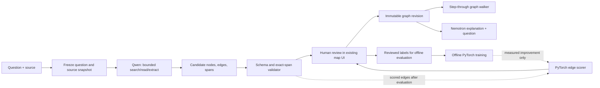

# Interactive system learning visualizer — proposed design

**Status:** Proposed on October 5, 2026. The map editor exists, but no model has generated its maps and no PyTorch relationship model has been trained. This document defines a new, testable product direction; it does not reinterpret earlier Qwen evaluations as results for this task.

## The first version

Keep one workflow: **source → proposed map → reviewed connections → walkthrough**. For the first generated-map path, the user supplies at least one URL or supported file; a question alone does not establish evidence. Qwen proposes the map; a small PyTorch model scores its proposed connections; the user decides what to save. The PyTorch score is a review aid, not an automatic truth label. Nemotron can explain a saved path on demand for the hackathon demo. Personalization, diagram-image recognition, and live performance simulation are later ideas, not dependencies for this version.

## Product promise

Give the app a question about a technical system and a paper, documentation page, or code excerpt. It proposes an editable model of the components and how information moves between them. The user can walk through a path, inspect why a connection was drawn, fix the map, and check their understanding with a short prediction question.

The product is for **understanding an existing system from evidence**. Miro already [generates editable architecture diagrams from descriptions](https://miro.com/ai/diagram-ai/block-diagram-generator/) and [can use documents and PDFs as context](https://miro.com/ai-playbooks/technical-architecture/). Neither editable diagrams nor document input alone differentiates this project. The proposed distinction is that each important arrow is a reviewable claim tied to a source passage, the user can walk through the system and correct misunderstandings, and we measure whether a specialized model becomes better on unseen systems. That product hypothesis needs user testing; it is not a demonstrated advantage over Miro.

For a prompt without a source, any manually made map is a **provisional sketch**; model generation in this first version requires a source. A source-backed draft can show the exact passage behind a proposed arrow. Neither a valid quotation nor an appealing drawing proves the arrow's interpretation is correct.

## First user journey

1. The user asks, for example, “How does KV caching change one decoder step?” and adds a technical explanation by URL or supported file. The app freezes the source and the question.
2. Qwen investigates the frozen text with bounded `search()`, `read()`, and `extract()` calls. A new map-submission step proposes components and directed relationships, with inspected source spans when available.
3. The app validates IDs, endpoint existence, size limits, and exact source offsets. It lays out the graph deterministically. The draft is shown beside the source; nothing is silently added to the reviewed map.
4. Once evaluated, a small PyTorch model scores each proposed arrow against its cited passage and flags uncertain ones for review. The user's decision remains authoritative.
5. The user fixes or accepts the draft. The app saves a dated map revision. Selecting an arrow shows its meaning and source; “walk through” highlights a path one step at a time. This is graph traversal, not an automatic causal simulation. For the hackathon demo, an on-demand Nemotron tutor explains the **reviewed** path using the saved graph and selected passages.

## System boundary

The graph is the canonical artifact. Qwen emits **structured nodes and edges**, not ASCII art or pixel positions. A deterministic layout fills positions for the existing SVG editor; Mermaid is an export for Markdown and Obsidian. ASCII is only a compact way to explain a map in a terminal or chat. A graph retains direction, IDs, revision history, and testable relationships across all renderings.

## Concrete runtime architecture

This remains **one local FastAPI application**, not a fleet of agents or services. The existing `/lab/map` page is the interface. The existing source import endpoints freeze web pages or supported files; the existing map store holds accepted revisions. Only Qwen inference and the on-demand Nemotron call need a model endpoint. The PyTorch scorer can run in the local application on CPU.

| Part | Input → output | Responsibility |
| --- | --- | --- |
| Source adapter | Selected thread source IDs → one read-only searchable corpus | Index exact extracted text while preserving each original source ID and character offset. Never let Qwen browse beyond the selected snapshots. |
| Qwen map worker | Question + corpus → `MapCandidate` + tool trace | Reuse the bounded Docker `search/read/extract` loop, with a separate map-submission protocol. The current answer packet cannot be treated as a map. |
| Validator and layout | Candidate → previewable graph | Check schema, graph limits, real endpoints, source IDs, and exact spans; assign stable IDs and deterministic positions. Keep every edge as a proposal until reviewed. |
| PyTorch edge scorer | Passage + ordered candidate edge → review score | Score whether the cited passage supports that direction and relationship. Show the score beside the passage in the evaluation view; use it to prioritize review only after a held-out gain. |
| Map store | Edited graph + expected revision → new immutable revision | Save only a human-reviewed graph; reject an acceptance if the map changed since preview. |
| Nebius/Nemotron tutor | Accepted path + selected receipts → explanation | Read-only, on demand. It cannot revise the graph or add uncited edges. |

The browser starts a run with `POST /api/lab/threads/{thread_id}/map/runs`, sending selected `source_ids` and the map's `base_revision_id`. A single local worker records `queued → running → proposed | failed` under the app state directory. The browser polls `GET .../map/runs/{run_id}` for status, the bounded Qwen trace, candidate graph, source receipts, and optional PyTorch scores. This needs no Redis, separate database, or always-on GPU. Interrupted runs stay visible as interrupted; they are not silently retried.

`MapCandidate` contains node labels/types and edges of the form `(source_node, edge_type, target_node, source_id, start, end)`. It contains no screen coordinates and no claim that an edge is already documented or measured. The server resolves each supplied span against the frozen source and returns a preview. An edge without a span remains an unsupported hypothesis and cannot receive a PyTorch passage score. The UI lets the user keep, edit, reject, or mark an edge uncertain. The review decision is recorded explicitly; a removed edge is not automatically a negative training label.

Accepting calls `POST .../map/runs/{run_id}/accept` with the edited `MapInput` and expected revision. The revision comparison and save must happen under the map store's lock; a mismatch returns `409` and asks for another review. The accepted map uses the existing immutable revision store. Qwen failure leaves the current map untouched; PyTorch failure leaves manual review available; Nemotron failure leaves the saved map usable.

Offline, an evaluation script compares base Qwen and the existing checkpoint on the same frozen source-to-map tasks. A separate PyTorch training script consumes only reviewed edge labels, splits by source family, saves the model/tokenizer/version, and evaluates the scorer against the Qwen-only review queue. Neither training nor inference writes into the reviewed Obsidian library.

### Jev-led alternative to test, not another runtime dependency

TypeSafe's [function-calling example](https://docs.typesafe.ai/cookbooks/function_calling) shows Jev choosing an ordinary function and closed-set arguments while application code performs the call. A bounded map builder could therefore extract candidate component phrases and source spans in code, have Jev select useful nodes and classify candidate directed edges, then let code assemble and draw the graph. Repeated `search/read` steps are possible if the host supplies a finite list of queries and document IDs at each step. Jev itself does not execute tools or invent unrestricted arguments; TypeSafe [recommends a generative model or other extractor for open-ended candidate strings](https://docs.typesafe.ai/model-jaggedness/jev-1.13).

Test that **Jev + candidate extraction** path on the same small, human-reviewed sources as Qwen. Compare node recall, directed-edge precision, correction time, and cost. Keep it only if it makes a comparably useful map with less work; do not add Jev alongside Qwen and the PyTorch scorer merely because it is available. This is a proposed experiment, not an observed result.

Jev itself is [not customer fine-tunable](https://docs.typesafe.ai/models): TypeSafe serves the same weights to every account. Better Jev behavior would come from better candidate phrases, short relevant source passages, clearer decision criteria, and code that combines decisions. For **weight training**, collect independent human-reviewed examples of `(frozen source, question, reviewed nodes, directed typed edges, evidence spans, rejected candidate arrows)`. A folder of diagrams alone lacks the input-to-output alignment this task requires. Use these labels to train a PyTorch component extractor or edge scorer according to the first measured error, or later fine-tune Qwen on complete source-to-map trajectories if proposal quality is the bottleneck. Do not use Jev decisions as imitation labels; [TypeSafe's agreement restricts that use](https://typesafe.ai/legal/mca).

## What is reused, and what must be built

| Existing | New work |
| --- | --- |
| `/lab/map` editor, arrow inspector, source shelf, proposal preview, dated revisions | Model-authored proposal route and server-side stale-revision check |
| Frozen web, Markdown, text, and text-extractable PDF sources | Per-thread Qwen corpus adapter preserving original source IDs and character offsets |
| Qwen's multi-step code-execution investigation of a frozen corpus | A bounded `MapCandidate` output protocol; the current investigator only submits answers |
| Exact-span and graph-schema checks | Human-reviewed semantic edge labels and a source-to-map evaluation set |
| Optional Nebius/Nemotron wording suggestion | Path-specific tutor response and prediction question from an accepted map |
| Manually authored Transformer map demo | Model-generated draft clearly marked as such |

The current Qwen3-8B checkpoint is text-only. Screenshot-to-graph recognition would require a separate vision model and image ingestion; it is not on this first path. The earlier trained checkpoint has not been evaluated for map construction. Base Qwen, that checkpoint, and any other candidate must face the same source-to-map examples before we claim one is better.

## Graph and review contract

The existing `MapInput` schema in `src/product/learning_lab_api.py` is the save format: typed nodes, directed typed edges, positions, optional exact passage offsets, and a revision summary. Model output should use a smaller `MapCandidate` without positions. The host assigns stable IDs, applies layout, and validates the result before preview.

- Keep the initial model draft small: at most 12 components and 20 connections from one bounded source bundle. Existing storage limits are larger.
- Mark unreviewed semantic relationships as proposals/hypotheses. Exact spans prove provenance only; a person decides whether an arrow is documented or measured.
- Store source snapshot hashes, model/checkpoint revision, prompt/protocol version, decoding settings, seed, tool steps, hardware, latency, and cost with every model run.
- Save an accepted draft only against the revision the user previewed. A concurrent edit makes the draft stale and requires a new review.
- The walkthrough may trace reachable edges and show recorded events. It must not infer performance or failure effects from topology alone.

## PyTorch workstream: score proposed connections

**Question:** Can a small trained model help users find incorrect or weakly supported arrows in Qwen's draft, at lower cost than another large-model pass?

Begin with 40–60 reviewed source windows to settle the annotation rules. For each proposed arrow, label whether the cited passage actually supports its **direction and relationship**; include plausible wrong and reversed-direction arrows. If labels are consistent, expand the training pool while keeping whole documents or source families out of training for a final test. Corrections made in the product can become new labeled examples only after review; they do not leak into the frozen test set.

The low-compute candidate is a [33M-parameter MiniLM encoder](https://huggingface.co/microsoft/MiniLM-L12-H384-uncased) with a PyTorch classification head. Given a short passage and one ordered candidate triple—such as `(decoder step, depends_on, cached keys and values)`—it predicts whether that passage supports the arrow. Train with cross-entropy and explicit class imbalance handling. Keep the passage short enough to preserve both mentions; do not silently truncate long source text. The score prioritizes review and is not a semantic proof.

Compare identical examples against Qwen-only graph proposals and simple phrase rules. If Jev access is available, use its [typed yes/no decision](https://docs.typesafe.ai/primitives/noul) as a hosted **edge-scoring baseline** on the same passage-and-arrow examples. Jev chooses or scores predefined options; it does not invent the graph's nodes and descriptions. Do not add it as another mandatory production model. Report accepted-edge precision and recall, strict directed/typed map-edge quality, source-span validity, human correction time, latency, and cost. Check Qwen's component recall separately so a missing node is not mistaken for an edge-scoring failure.

**Proposed training decision:** train only after the pilot shows stable labels and a recurring baseline error. Integrate the PyTorch scorer only if it improves directed-edge quality on the source-disjoint test without a material precision or latency regression. Report an inconclusive result if a paired uncertainty interval includes zero. The older MuSiQue or paper-answer metrics are separate experiments and do not establish map quality.

## What “self-improving” means here

Saving a map correction does **not** change Jev, Qwen, or PyTorch weights during that session. With the user's opt-in, an explicit keep/edit/reject decision plus its source passage becomes a reviewed training record. Periodically, we freeze a dataset revision, train the small PyTorch component or edge model offline, and run it against the same held-out source families as the previous version. Only a measured improvement is promoted. If repeated failures are whole-map omissions or bad multi-step investigations, we can later collect complete tool trajectories plus final reviewed maps for Qwen fine-tuning; that is a separate, more expensive experiment.

The app can remember a user's accepted maps immediately, but this is saved state, not weight training. Jev's weights are [not customer fine-tunable](https://docs.typesafe.ai/models), so a Jev-led workflow improves through better candidate extraction and decision criteria rather than Jev learning from each correction. The first release should be described as **feedback-ready**, not already self-improving.

## Later: preference model for explanations

Preference modeling is separate from map correctness and is **not part of the first version**. After users have reviewed real maps, the app could compare two views of the same correct graph and later train a small ranker to choose the clearer view. A wrong arrow is a graph error, not a visual preference. Sparse clicks are not a reason to run DPO or RL on Qwen.

## Demo and stop conditions

The first honest demo uses one technical system and its frozen source. A visitor asks a question, watches the actual Qwen tool trace, sees each proposed arrow beside its passage, corrects one connection, and steps through the accepted graph. An evaluation panel shows the PyTorch score beside the human label, including its mistakes; the score guides live review only if the held-out test supports that use. An on-demand Nemotron explanation makes the NVIDIA model's role visible. The viewer can open the source passage and the saved model-run manifest. A saved replay can keep the demo available without an always-on GPU; live inference remains an explicit on-demand operation.

The product is worth extending if users can explain a selected path, find a wrong or uncertain arrow, and revise the map with less effort than drawing it from scratch. The ML claim requires held-out improvement in identifying bad arrows over the no-scorer baseline. If the map is mainly decorative or the PyTorch score does not help review, report that result and keep the working map editor without expanding model complexity.

For the Nebius × NVIDIA submission, Nemotron must provide a meaningful runtime tutoring step through Nebius Token Factory or Nebius AI Cloud. Qwen and the PyTorch encoder demonstrate separate open-model investigation and training work; neither substitutes for that NVIDIA-model requirement.

## Build order

1. **Graph proposal pilot:** select a small fixed set of real technical explanations, review their gold nodes/edges, and run base Qwen and the current checkpoint with identical tools and settings. No training yet.
2. **Product slice:** connect per-thread frozen sources to the bounded Qwen worker, add model-authored draft preview, deterministic layout, stale-revision protection, and path walkthrough.
3. **PyTorch experiment:** label arrow failures, train the small passage-to-arrow scorer only if the baseline justifies it, and publish paired results and error examples. Show its score beside arrows only if it improves review on held-out sources.
4. **Hackathon finish:** add the on-demand Nemotron explanation of an accepted path and record a clear demo. Consider presentation preferences only after people use the core workflow.

This order keeps the working demo independent of a promised fine-tuning gain while making every model claim reviewable.
